本文将通过[神经网络配置系统](https://openai.weixin.qq.com/chat?debug=True)配置一个TextCNN模型进行文本分类。主要内容分为三部分：

* 数据处理：简单地介绍一下本文所用的数据，以及对数据进行预处理。
* TextCNN概述：介绍TextCNN。
* 使用神经网络配置系统配置一个TextCNN模型

### 数据介绍

数据主要来源于NLPCC Emotion Classification Challenge和新浪微博，它共包括4万多条句子,分为其他（Null), 喜好(Like)，悲伤(Sad)，厌恶(Disgust)，愤怒(Anger)，高兴（Happiness）六类，依次标号为0到5。 

完整数据的下载链接在： https://biendata.com/ccf_tcci2018/datasets/emotion/ 

我们将数据下载到本地之后，需要划分一下训练集、验证集、测试集以供使用，划分后的数据存放在[./data/processed](./data/processed) 目录。划分数据的代码在[process.py](process.py)中，这里就不详细展开了。

### TextCNN介绍

TextCNN就是使用卷积神经网络（ Convolutional Neural Network ，CNN）来提取文本特征进而实现分类的模型

。它的结构如下图所示：

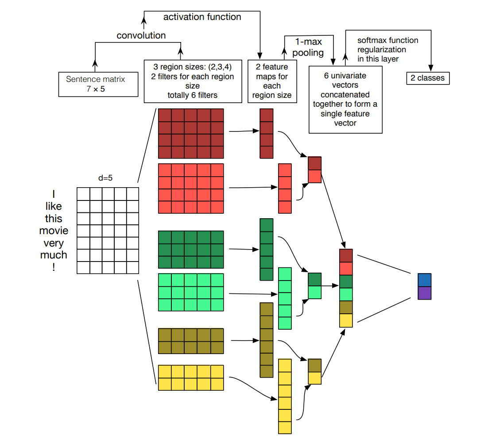

图中TextCNN的输入是`I like this movie very much !` ，将这些单词经过词向量进行编码之后可以得到一个矩阵，接着卷积神经网络会在这个embedding矩阵上提取特征，这些特征经过池化操作后再拼接在一起，作为最后一层--全连接层的输入，全连接层负责将这些特征从特征空间映射到类别空间，从而实现分类。

以上是TextCNN的概述。如果想要了解TextCNN的更多细节，可以参考以下文献：

 [Convolutional Neural Networks for Sentence Classification](https://arxiv.org/pdf/1408.5882.pdf) 

[A Sensitivity Analysis of (and Practitioners’ Guide to) Convolutional Neural Networks for Sentence Classification]() 

下文将展示如何使用神经网络配置系统配置一个TextCNN用于文本分类。

### 使用TFbot配置一个 TextCNN

首先进入神经网络配置系统的首页：https://openai.weixin.qq.com/chat，点击配置神经网络，然后输入模型的名字：

数据的特征文件和标注文件就在[data/processed](data/processed)，我们系统的提示进行输入即可：

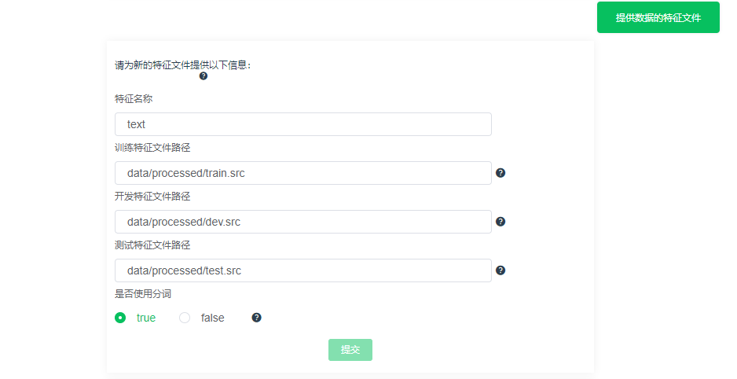

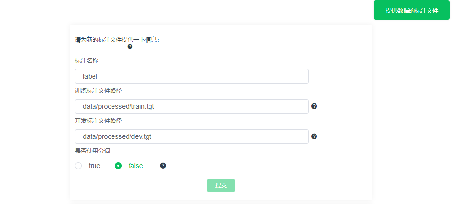

然后是设置训练的配置，我们使用默认的配置：

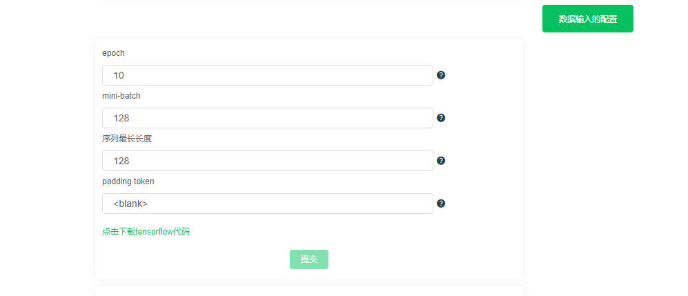

配置完训练参数，对话框里面对了一个选项：`配置标注的表示` ，这是因为我们需要将标注转化成计算机可理解的形式，这里我们选择转化为one-hot 表示，one-hot表示使用N维向量来对N个种类进行编码，每个种类都对应一个维度，并且在任意时候，只有一位是1，其余都是零值。 

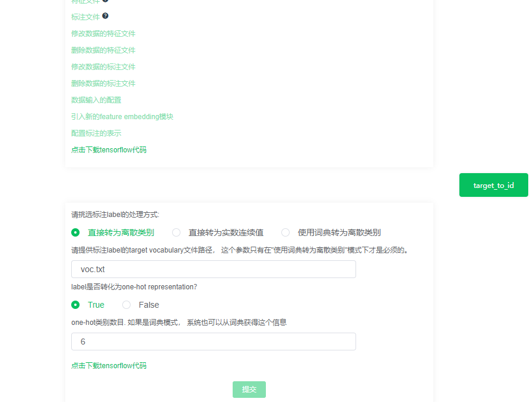

配置完标注的表示之后，我们就可以对网络结构进行配置了！首先我们需要添加`word embedding`：

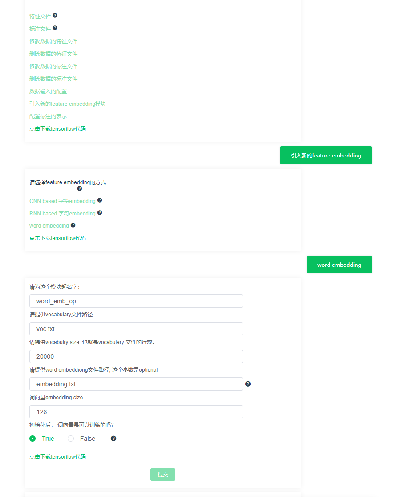

word embedding模块需要填写的参数主要是词向量的大小，我们这里采用默认的128维。其他字段系统都有详细的解释，根据自身需要进行配置即可。

添加word embedding的输入输出，很明显这里的输入就是text：

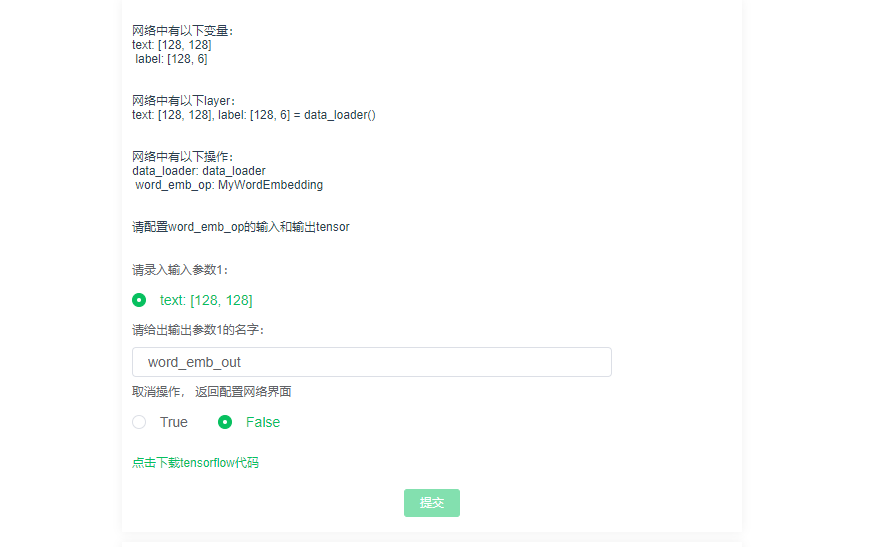

根据TextCNN模型的结构，我们接下来需要添加CNN模块，这也很简单，只需要在对话框中点击添加新的模块，然后选择CNN即可：

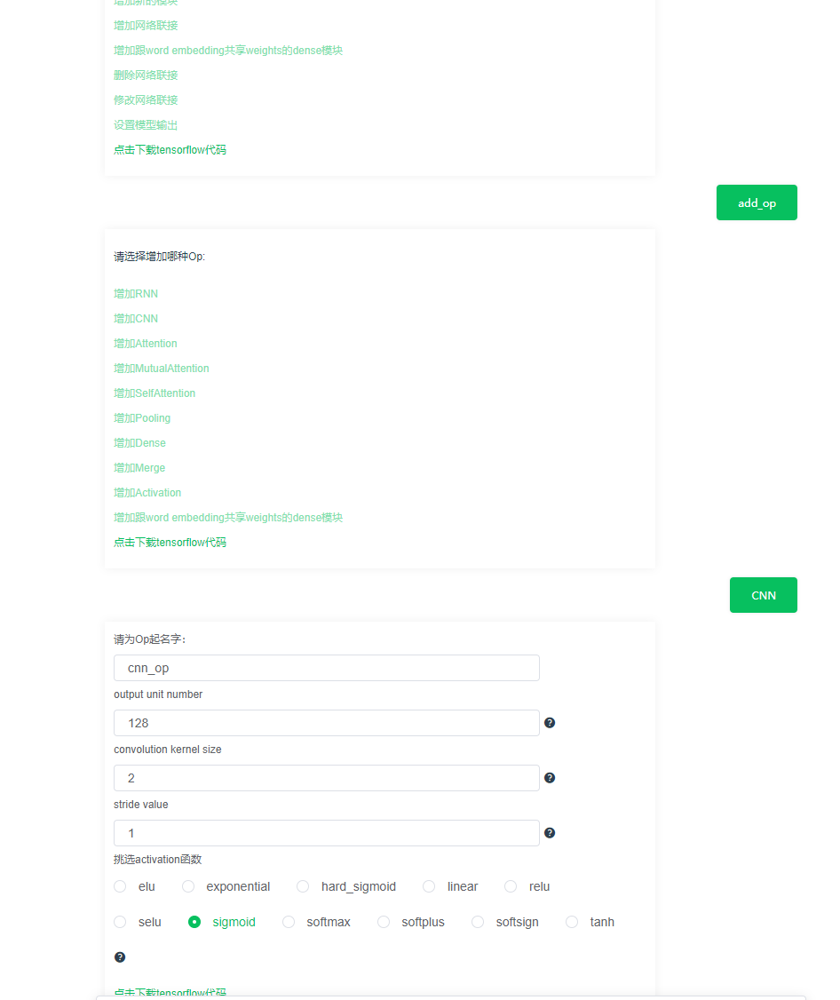

CNN的输入是词向量模块的输出，即我们上文中设置的`word_emb_out`：

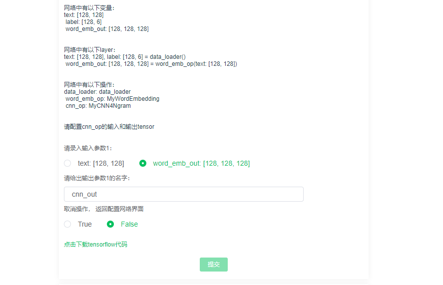

有了CNN模块，接下来我们需要添加的模块是池化（Pooling）操作，同样的点击`增加新的模块`，在弹出的对话框中选择`增加Pooling`：

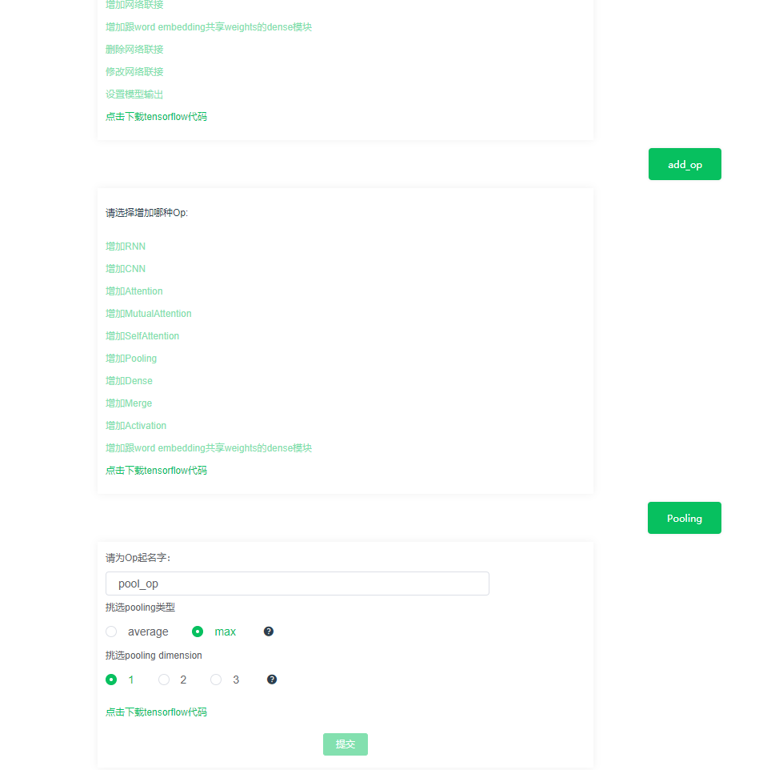

Pooling的类型我们设置为`max`，然后pooling dimension的设置需要格外注意，因为我们是在文本特征上进行池化，所以只要选择1就行了（如果是图片，则选择2维，可以这么简单理解：文字是一维的，图片是二维的。），Pooling的输入就是CNN的输出了，如下所示：

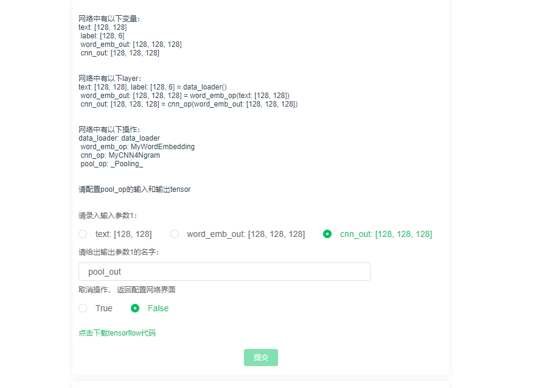

在pooling之后，我们就可以进行分类的，分类其实就是将特征空间的向量映射到类别空间，那么我们只需要添加一个全连接层就行了：

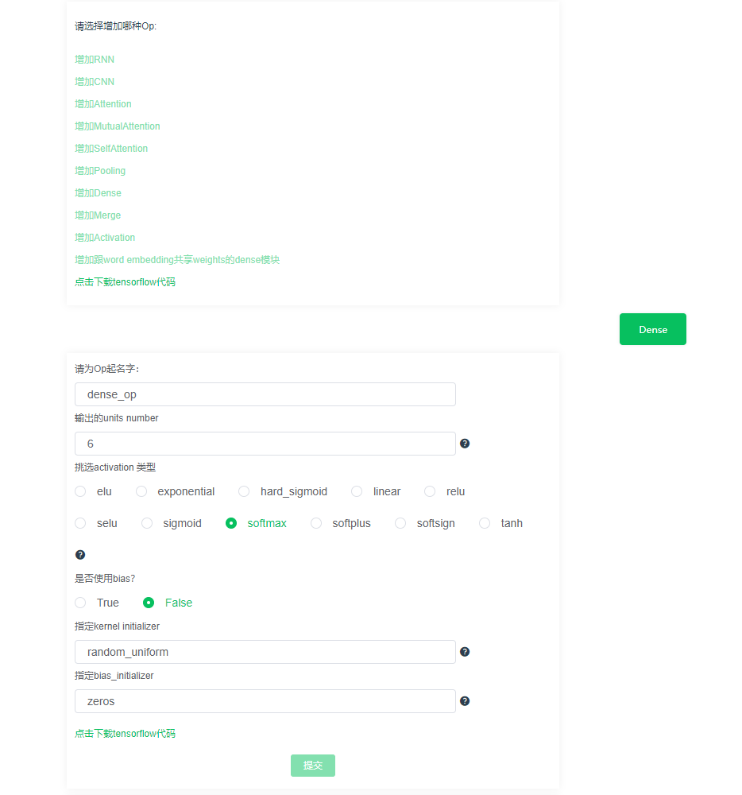

需要注意的是，这个全连接层的输出单元数量需要和你数据的标签数量保持一致。因为我们这里是6分类任务，所以我们选择6。activation的类型选择为softmax，这是因为softmax函数能够保证输出的是类别空间上的概率分布。在训练的时候，我们根据这个概率分布来计算损失，在测试的时候，我们根据这个概率分布来选择最后的类别。

全连接层的输入是池化操作的输出：

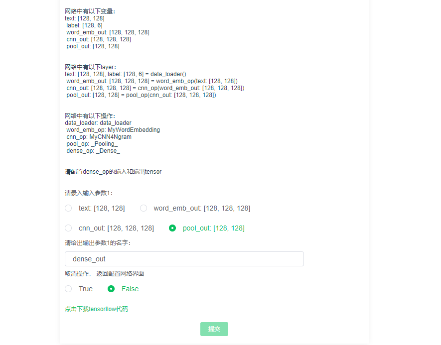

接下来我们将全连接层的输出设置为模型的输出：

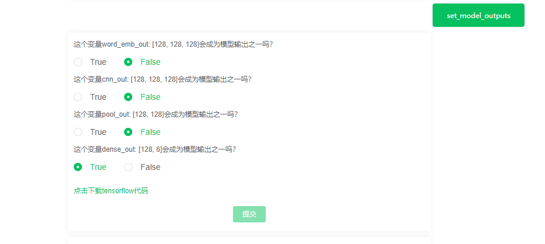

最后，我们还需要设置一下模型的损失函数，损失是根据模型的输出还有label来进行计算的，点击`设置模型训练的参数 --> 配置模型训练的损失函数  --> 增加新的loss `：

因为这里是多分类问题，所以损失函数设置为交叉熵即可。

有了损失函数，系统还需要知道用什么方法对损失函数进行优化，这就是优化器的设置：

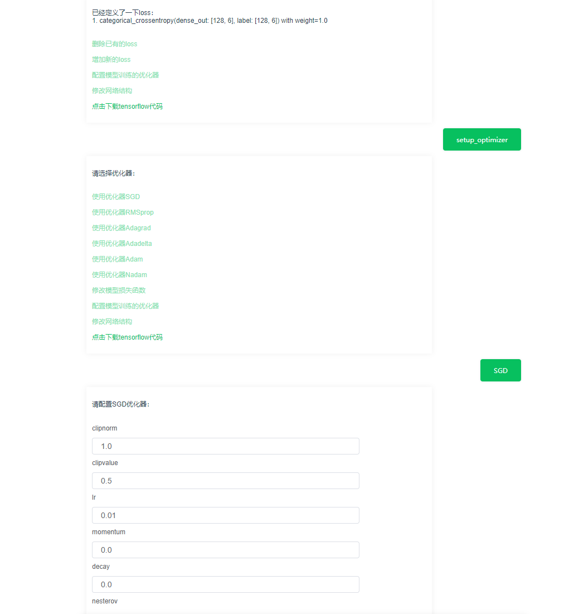

我们选择最简单的SGD（随机梯度下降），使用系统的默认配置即可。

到了这里，我们的神经网络就配置完毕了！

点击下载代码就可以得到把TextCNN用于文本分类的所有代码了！Enjoy it！

